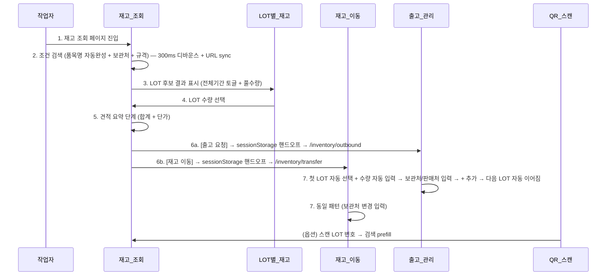

# A5 재고 조회 3단계 플로우

> 자동 생성. /wrap-up이 ## 흐름 변경 감지 시 갱신.
> 마지막 갱신: 2026-05-18

## 시퀀스

## 관련 노트

- [[A5_재고_조회_3단계_플로우]] (소스)
- 모듈: [[재고_조회]], [[LOT별_재고]], [[재고_이동]], [[출고_관리]], [[QR_스캔]]
- Actor: 작업자
